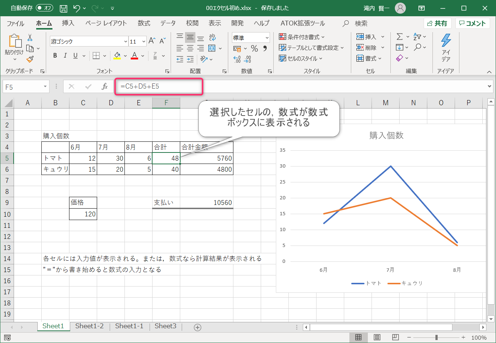
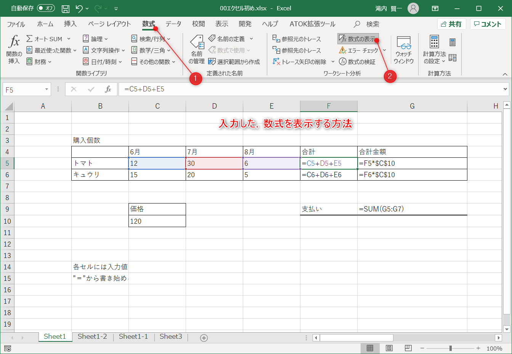
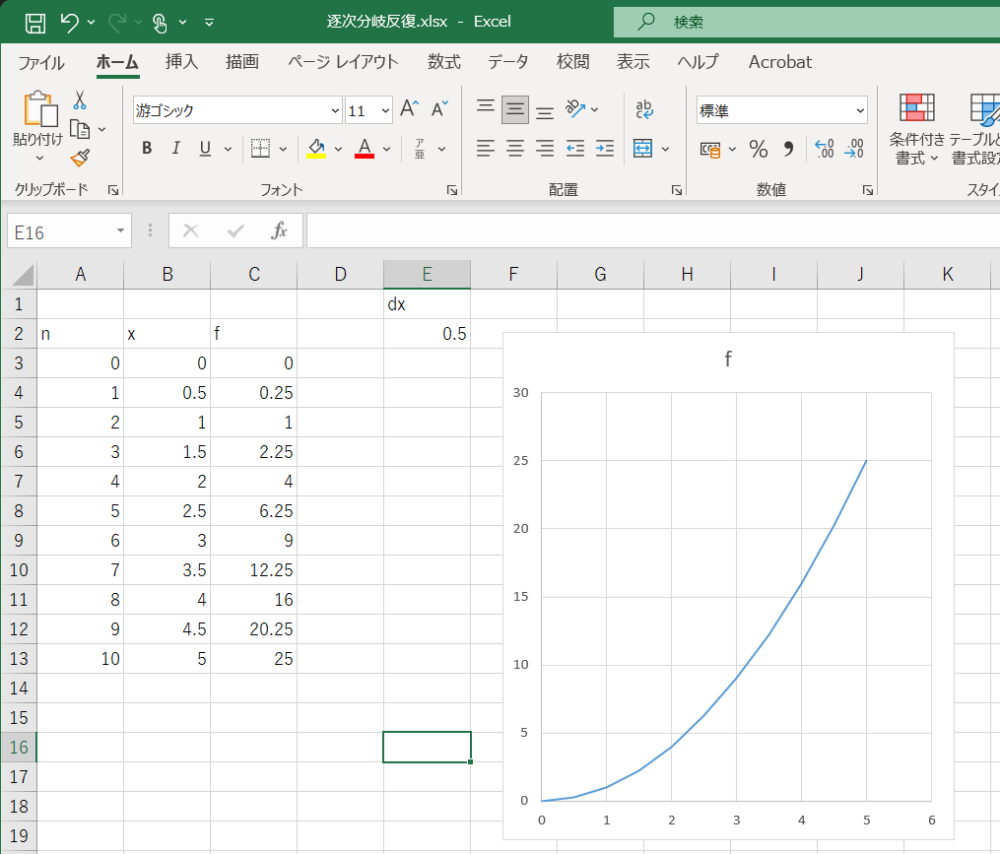
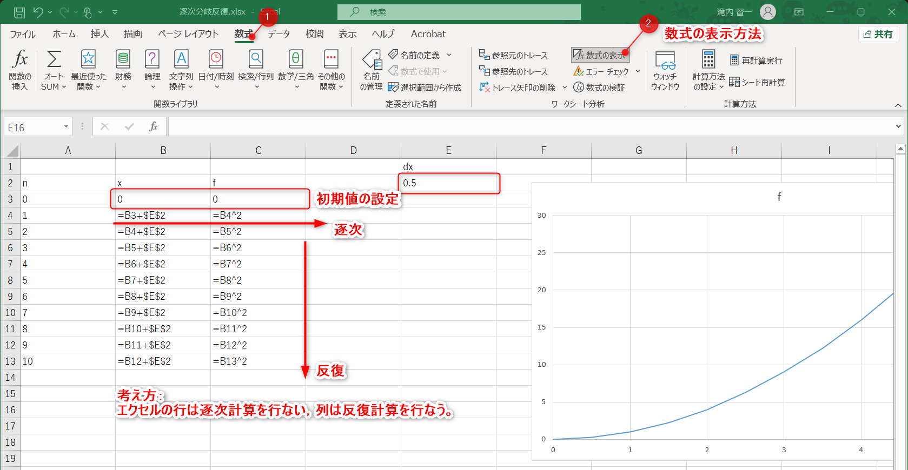

# 2024年度
# コンピュータ物理学演習１

内容は適宜更新して行きます．（2024年8月20日~）

理系教育センター 滝内

---

## 第１回

### エクセルの基本（簡単なまとめ）

エクセルは表計算ソフトです。表計算という名前どおり「表を作ること」と「計算すること」という二つの機能が併せ持ったものです。

表を見ると，ここに表示されているセル（ひとマス）の内容は，
「入力した文字が表示されているセル」と「計算式によって計算された結果が表示されているセル」の２種類あることがわかります。

この２種類の表示が一緒に表示されてます。

計算式は計算結果が表示されますので，計算式がどのようなものかは分かりづらいです。計算式を見るためにはセルを選択してその表の上に表示される「数式ボックス」を見ると，実際に入力した数式が表示されます。

表のすべての計算式を一度に見るためには，「数式タブ」の「数式の表示」を押すと見られます。

### オートフィル

例えば，この表はきゅうりとトマトを各月どれぐらい購入したかを表わす表です。トマトの合計個数は6月，7月，8月を足したもので，きゅうりの合計個数も同じです。

金額合計は合計個数かける価格です。トマトの合計金額ときゅうりの合計金額を足して支払額となります。

よく見ると合計個数などは，隣り合ったセル番号を連続して記入してることがわかります。今の場合，合計個数では足し算を行なっています。

この「隣り合ったセル番号が多く現れる」ことを覚えておきましょう。

「隣り合った連続のセル番号を効率的に入力する」ために，次のオートフィル（自動記入？）という機能を使うと，Excel をより便利に利用することができます。

    オートフィルを使うと入力の手間が省けます。
    オートフィルとはすでに入力してある内容にしたがって
    次に入力する内容をルールに従って自動的に入力してくれる機能です。

    たとえば「１」「２」と連続して入力してあるセルに対して
    オートフィル（マウスのポインタが黒十字になるとオートフィルができます）
    を使うと「１」「２」「３」「４」・・・と連続して入力してくれます。 
    	 
オートフィルについての動画   [エクセルの基本操作(mp4動画)](./rec-a01.mp4)

（オートフィルのルールについては，ファイル＞オプション＞詳細設定＞全般＞ユーザ設定リストの編集 ボタンより閲覧できまたは編集可能です。）

### プログラミングとエクセル

構造化プログラミングの考え方には，「構造化プログラミング」というものがあります。

制御構造

    １）順次（逐次）　上の行から書いた順番どおりに順々に実行する

    ２）分岐　条件によって実行する内容を分岐する

    ３）反復　指定した範囲の実行を繰り返す

このような制御構造をエクセルの表計算で可能かどうか，プログラミングの流れを体験してみます。

２）分岐をエクセルで行なうのは面倒ですが１）順次（逐次），３）反復はわかりやすいです。

イメージとして，「$y=x^2$グラフを描くこと」は逐次と反復の計算によって実現できます。

- ステップ1　$x_0=0$ , $f_0=0$, $\Delta x=0.5$として　初期値の設定

- ステップ2　$x_{n+1}=x_{n}+\Delta x$, $f_{n+1}=(x_{n+1})^2$ を計算　－＞逐次

$n$を増やして，$n=0$から初めて$10$まで計算を繰り返す　－＞反復

<!---    -->

<!---  --->
   

   
   

「数式の表示」をした2次関数のエクセルグラフ

   [オートフィルを使って二次曲線グラフを作る(mp4動画)](./2024-08-19.mp4)

横軸も縦軸も数値の場合でグラフで描くときは，「2-D折れ線グラフ」ではなくて，「散布図（直線）」または「散布図（直線とマーカー）」でグラフを描いてください。

<!--
   [二次曲線グラフ(4)](http://www.sp.u-tokai.ac.jp/taki/cpe01/n01-04.png)
-->

### 参考URL 数式，関数について

[マイクロソフト Excelの数式の概要](https://support.microsoft.com/ja-jp/office/excel-%E3%81%AE%E6%95%B0%E5%BC%8F%E3%81%AE%E6%A6%82%E8%A6%81-ecfdc708-9162-49e8-b993-c311f47ca173)

[マイクロソフト Excel関数(機能別)](https://support.microsoft.com/ja-jp/office/excel-%E9%96%A2%E6%95%B0-%E6%A9%9F%E8%83%BD%E5%88%A5-5f91f4e9-7b42-46d2-9bd1-63f26a86c0eb)

[マイクロソフト フィルハンドルをドラッグして数式をコピーする](https://support.microsoft.com/ja-jp/office/excel-for-mac-%E3%81%A7%E3%83%95%E3%82%A3%E3%83%AB%E3%83%8F%E3%83%B3%E3%83%89%E3%83%AB%E3%82%92%E3%83%89%E3%83%A9%E3%83%83%E3%82%B0%E3%81%97%E3%81%A6%E6%95%B0%E5%BC%8F%E3%82%92%E3%82%B3%E3%83%94%E3%83%BC%E3%81%99%E3%82%8B-dd928259-622b-473f-9a33-83aa1a63e218)

<!--
### 関数のグラフ
-->
<!-- 
### Mathematica 12 の起動

  Wolfram Mathematica 12 アプリを起動
  
  新規ドキュメント
  
  計算の実行と文字の拡大の仕方
  
  Mathematica の最初のステップをやってみる（バーチャルブック）

   > ドキュメント＞”バーチャル”検索＞バーチャルブック＞はじめに＞Getting Started
   
   > ヘルプ＞Wolframドキュメント＞”tutorial”検索＞Getting Started (Wolfram言語概要)＞Wolfram言語の最初のステップ
   
   > ヘルプ＞Wolframドキュメント＞”tutorial/YourFirstWolframLanguageCalculations”検索
    
   [Mathematica 11 英語でのハンズオン ビデオ](https://youtu.be/O6h9_Xx-nLA)

-->

---
