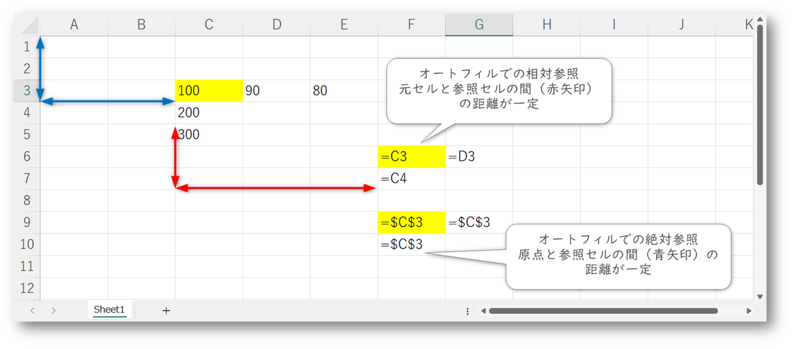

# コンピュータ物理学演習１

2024年10月31日 理系教育センター 滝内

---

## 第２回

### エクセルでグラフを作成してみる

注意：横軸も縦軸も数値の場合でグラフで描くときは，「2-D折れ線グラフ」ではなくて，「散布図（直線）」または「散布図（直線とマーカー）」でグラフを描いてください。

### 変数と定数

`$`をセル番号につけるとオートフィルでセル番号が変化しない。セル番号が固定されます。これを絶対参照といいます。

例
   
`$A2`
   
Aはオートフィルで変化しない。2はオートフィルで変化する
   
`$E$1`
   
Eも1もオートフィルで変化しない。

 	  
- グラフ作成 $y = x^2$ と $y = 1.2 x^2$ 

### $y = \cos(x) $のグラフ作成

$ y = \cos(ax-b) $ のグラフを描いてみる。パラメータ$a$, $b$ を変えてみる。グラフの変化を確認する。

[オートフィルを使ったcos(x)グラフの作成(動画)](./2024-08-19_2.mp4)

$\cos(ax-b)$ の表について，位相部分を ` $D$3*A6－$D$4 ` としてオートフィルでD列を計算しよう。

`D4`の1を2，3，4と変えるとグラフはどう変化する？
    
また，`D3`の1を2，3，4と変えるとグラフはどう変化する？

### 物理量の測定

参考　新編　物理学実験，東海大学出版会 より引用します。

> 測定したデータ（データの集まり）についてデータの解釈の方法として統計的手法を行なう。
> 
> 測定したデータはばらつくので，理論上はたくさんの（無限の）データが必要となるが，可能な測定回数のデータ数から本当の測定値を推定する。
> 
> データの集まりの平均値，データの集まりのばらつきが重要。
> 
> ばらつき（偶然誤差）という誤差は，正と負に同等の確率で起こるとみなす。小さな誤差の起こる確率は大きく，大きな誤差の起きる確率は小さい。
> 
> 測定回数が多くなれば誤差の分布はガウス分布（正規分布）になる。（中心極限定理という） 

### 正規分布のグラフを描く

正規分布には変数の他に二つのパラメータをもつ

平均　$\mu$　正規分布の形は左右対称であり，その中心が平均値

分散　$\sigma^2$　正規分布の左右への広がり具合を表わす

$$
f(x)=\frac{1}{\sqrt{2\pi}\sigma}e^{-\frac{1}{2\sigma^2}(x-\mu)^2}
$$

はじめに平均 $\mu$＝7 $\sigma$＝0.8　の正規分布を作成してみる

B5 セルに入力する式
    
`=EXP(-1*($A5-$C$1)^2/(2*$D$1^2))/(SQRT(2*PI())*$D$1)`

[オートフィルを使ったグラフの作成(動画)](./2024-08-20_2.mp4)

二つめに平均$\mu$＝7　$\sigma$＝1.6　の正規分布を上のグラフに重ねて作成してみる

[オートフィルを使ったグラフの作成(動画)](./2024-08-20_1.mp4)

### RLC回路と電荷の変化

RLC回路を考える。コンデンサに蓄えられた電荷 Q についての時間変化は
キルヒホッフの法則と電流の定義$ I=\frac{dQ}{dt}$より

$$
L\frac{d^2Q}{dt^2}+R\frac{dQ}{dt}+\frac{Q}{C}=0
$$

微分方程式を得る。

(両辺を$t$で微分すれば，
$$
L\frac{d^2I}{dt^2}+R\frac{dI}{dt}+\frac{I}{C}=0
$$
の形となる。ここでは$Q$を求めるが，微分方程式の形は同じなので，同じ考えにより$I$を求めることもできる。)

$$
Q(t)=Q_0 e^{\lambda t}
$$
のように仮定して，特性方程式
$$
L\lambda^2+R\lambda+\frac{1}{C}=0
$$
より，解を求める。
$$
\lambda=-\frac{R}{2L}\pm\sqrt{\left(\frac{R}{2L}\right)^2-\frac{1}{LC}}
$$

$R,L,C$の大小関係により解の形が変化する。

$$
\kappa=\frac{R}{2L}
$$
$$
\omega=\frac{1}{\sqrt{LC}}
$$

として，
$$
\left(\frac{R}{2L}\right)^2-\frac{1}{LC}=\kappa^2-\omega^2
$$
の正負により場合分けを行なう。初期条件として$t=0,Q=Q_0,\frac{dQ}{dt}=I=0$を考える。

1）過減衰

$\kappa^2-\omega^2 > 0$ の場合

初期条件を考慮して

$$
Q=\frac{1}{2}Q_0e^{-\kappa t}\left\{  \left(1+\frac{\kappa}{\beta}\right)e^{\beta t}+ \left(1-\frac{\kappa}{\beta}\right)e^{-\beta t}\right\}
$$
$$
\beta = \sqrt{\kappa^2-\omega^2}
$$

2）臨界減衰

$\kappa^2-\omega^2 = 0$ の場合

初期条件を考慮して

$$
Q=Q_0e^{-\kappa t} \left( \kappa t +1 \right)
$$

3）減衰振動

$\kappa^2-\omega^2 < 0$ の場合

初期条件を考慮して

$$
Q=Q_0e^{-\kappa t}\left\{  \cos\left(\Omega t\right)+ \frac{\kappa}{\Omega}\sin\left(\Omega t\right)\right\}
$$
   
$$
\Omega = \sqrt{\omega^2-\kappa^2}
$$

この3つの解をグラフで描いてみる。Q1が1）過減衰，Q2が2）臨界減衰，Q3が3)減衰振動。

数値を入力するのはA列，E列，F列，G列

数式を入力するのはB列，C列，D列，H列，I列，J列

$Q_0=1$ としている。

Q1 過減衰の式

   
Q2 臨海減衰の式

   
Q3 減衰振動の式

[グラフの調整（凡例）](./2021-no2-08.png)

方程式のパラメータ$ R,L,C $ を変化させると，解のかたちはどのように変化するか試してみよう（$\kappa^2-\omega^2$の条件に注意）。

Q1とQ2，Q3の関数は $\kappa^2-\omega^2$が0付近で滑らかに一致しそうだろうか？

例えば$R,L$は固定して，セル `G2` の$C$の値を0.0005にしてみたり，セル `G4` の$C$の値を0.0003にして確認してみよう。

### エクセルの数式入力についての注意点

**マイナス (-) について気をつけること！**

`-A6^2`　は　(-A6)^2 のように計算されます。つまり計算結果は**正**になってしまいます。
    
マイナスも含めて２乗されるので注意して下さい。
    
`-1*A6^2` のマイナス１は２乗されないようです。

