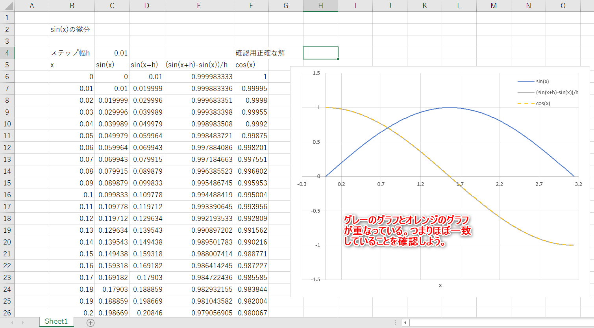
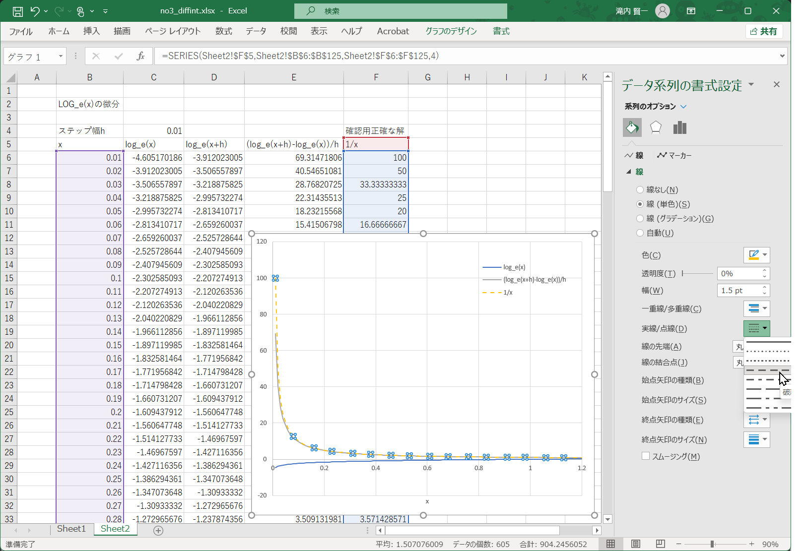
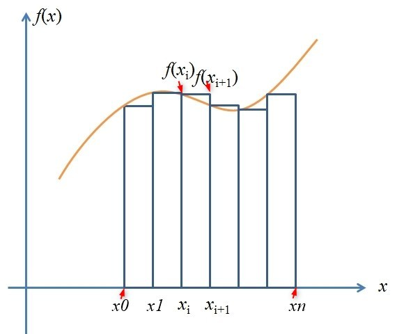
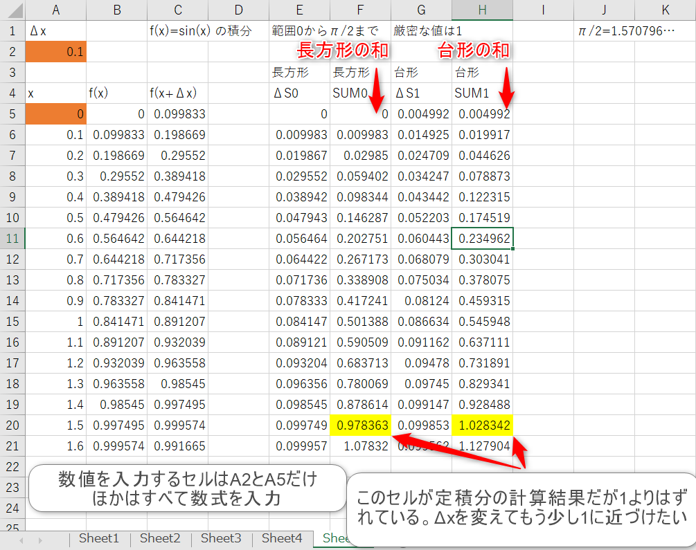
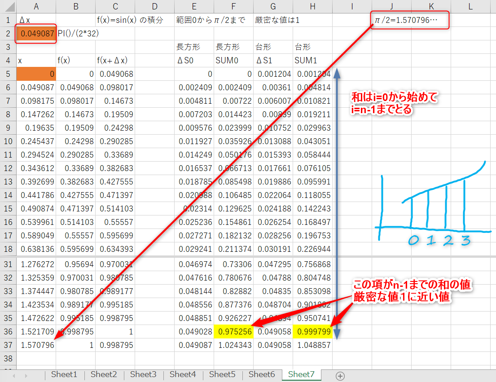
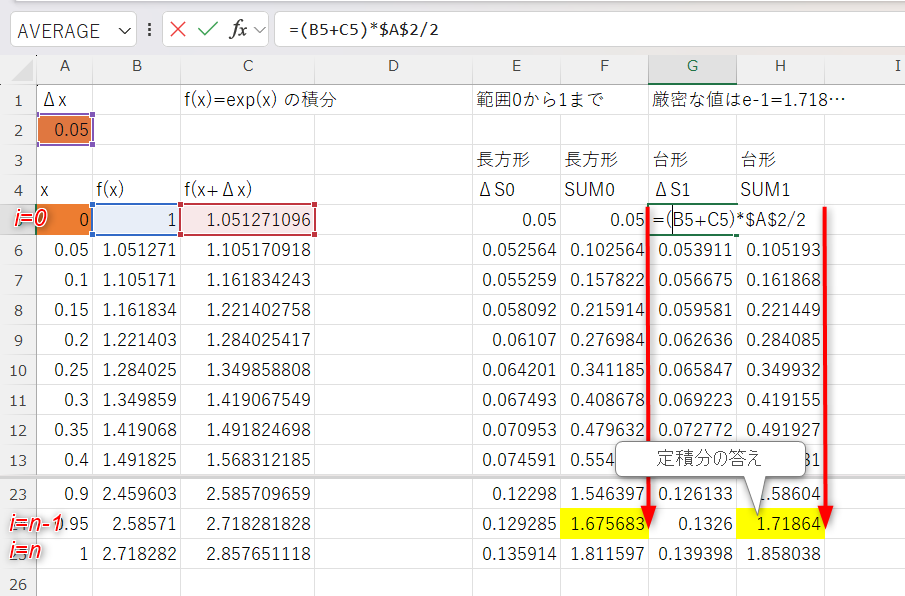
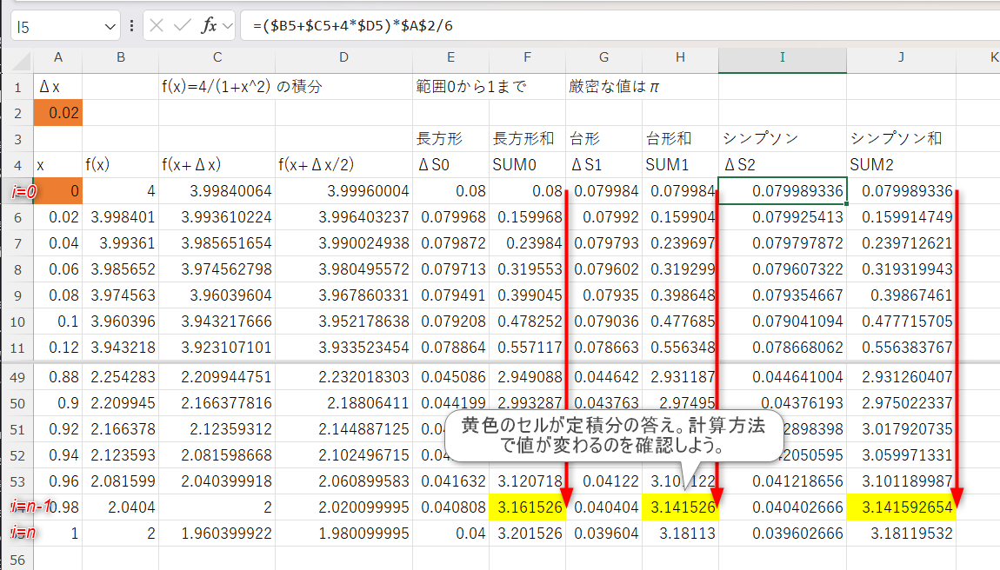

# コンピュータ物理学演習１

- 2025年度

```
2025/08/20
東海大学理系教育センター
滝内賢一
```
---

## 第３回

### Excel で行なう，数値微分，数値積分


### （１）Excelで微分をおこなう

微分には極限操作がおこなわれているが計算機は有限の値しか扱えないので，極限の代わりに微少な量として差分を考える。

微分

$$
\frac{d f(x)}{d x}=\lim_{h\rightarrow 0}\frac{f(x+h)-f(x)}{h}
$$

の定義から，差分の定義を考えると何通りかできそう。

前進差分商

$$
\frac{\Delta f(x)}{\Delta x}=\frac{f(x+h)-f(x)}{h} 
$$

後進差分商

$$
\frac{\Delta f(x)}{\Delta x}=\frac{f(x)-f(x-h)}{h} 
$$

中心差分商

$$
\frac{\Delta f(x)}{\Delta x}=\frac{f(x+h/2)-f(x-h/2)}{h} 
$$


### 「微分」三角関数 $\sin(x)$ の微分が $\cos(x)$になっていることを差分を使って数値的に確かめる

`x`の範囲を`0`から`3.14`までとしてステップ幅`h`を`0.01`として差分を計算してみる。（授業スライドまたはPDF資料の$\Delta x$ について $\Delta x = h $ としています。）

[1.表計算 動画](./media/2024-08-21_1.mp4)

[2.グラフ作成 動画](./media/2024-08-21_2.mp4)

[表計算ポイント1](./media/2024-08-21_2.png)

[表計算ポイント2](./media/2024-08-21_3.png)

[表計算ポイント3](./media/2024-08-21_4.png)

[表計算ポイント4](./media/2024-08-21_5.png)



練習

- エクセルで作成した表からグラフを作図してみよう。差分した値のグラフと正確な微分の値（cos(x)）の値が一致しているかどうかをグラフから確認しよう。

- 差分に設定する微少な量（ここではステップ幅 $h$ としている）セル`C4`の値を0.01 から 0.05, 0.1 などにするとグラフがどう変化するかを確認しよう。

- 前進差分商で計算したが，これを中心差分商にするとどう変化するかを確認しよう。

- 関数$f(x + h)-f(x)$を$h$でテーラー展開した式と関数$f(x + h/2)-f(x - h/2)$を$h$でテーラー展開した式を比べてみよう。

エクセル操作について

[表計算にスピル機能を使った場合の例](./media/2025-0203_1.png)

### 「微分」 $\log_e(x)$ の微分が $\frac{1}{x}$ になっていることを確かめる

`x`の範囲を`0.01`から`1.20`までとしてステップ幅`h`を`0.01`として差分を計算してみる。

自然対数LOGの関数は =LN（値） と入力します。
    


練習

- エクセルで作成した表からグラフを作図してみよう。差分した値のグラフと正確な微分の値（1/x）の値が一致しているかどうかをグラフから確認しよう。

- グラフを見てみると差分は正確な値のグラフとx=0.01近くでずれている。差分に設定する微少な量（ここではステップ幅 $h$ としている）セル`C4`の値を0.01 から 0.005 にするとグラフはどう変化するかを確認しよう。****

- 前進差分商で計算したが，これを中心差分商にするとどう変化するかを確認しよう。

エクセル操作について

[表計算にスピル機能を使った場合の例](./media/2025-0203_2.png)

### （２）Excelで積分をおこなう

積分にも極限操作がおこなわれている。やはり極限の代わりに微少な量として差分を考えよう。
すると積分は差分量の足し算によって計算値を近似できそうである。ここでは定積分を考えよう。

$$
\begin{align}
\int_a^b f(x)dx &=\lim_{n\to \infty}\sum_{i=0}^{n-1}f(x_i)\Delta x\\
\Delta x &=\frac{b-a}{n} ,\;\; x_i=a + i \Delta x
\end{align}
$$


    
関数 $y=f(x)$ の数値による定積分を考える。$x_{i+1}-x_i=\Delta x$ とする。

- 方形公式

長方形の面積を初期値 $a$ から足してゆく場合

$$
\int_a^b f(x)dx \sim \sum_{i=0}^{n-1}f(x_i)\Delta x
$$

$f(x)\Delta x$ は積分の微少区間$\Delta x$ の間の面積を表わしている。この面積をxの範囲aからbまで足し算する。

- 台形公式

面積を台形で近似する。この面積を初期値 $a$ から足してゆく場合

$$
\int_a^b f(x)dx \sim \sum_{i=0}^{n-1}\frac{1}{2}\left(f(x_i)+f(x_i+\Delta x)\right)\Delta x
$$

**注意**

定積分を数値積分で行なうとき，和の最後の項$i=n-1$までの和であることに注意。$i=n$ まで足し合わせると足しすぎになる。図を使って確認しよう。

### 「積分」 $\sin(x)$ の定積分

$$
\int_{0}^{\frac{\pi}{2}} \sin(x) dx
$$

($x=0$から$x=\pi/2$ )を調べてみる

   方形積分，台形積分を比較する。

$$
\begin{align}
方形公式\;\; \Delta S0=f(x_i) \Delta x ,\;\; \mathrm{SUM0}=\sum_{i=0}^{n-1} \Delta S0 \\
台形公式\;\; \Delta S1=\frac{1}{2}(f(x_i)+f(x_i+\Delta x)) \Delta x ,\;\; \mathrm{SUM1}=\sum_{i=0}^{n-1} \Delta S1
\end{align}
$$

とりあえず，$\Delta x=0.1$ として0から1.6まで計算してみる。



$\Delta x$ を変えて，積分範囲を修正しよう。

n=32, a=0, $b=\pi/2$ として，セルA2 を変更

$$
\Delta x=\frac{b-a}{n}=\frac{\pi}{2\times 32} = 0.049087
$$

微少量$\Delta x$ が変化すると数値積分の和の範囲も変化するから表計算の範囲も変更しよう。



方形公式の計算結果と台形公式の計算結果を比べてみよう。それぞれの値を厳密な定積分の値`1`とも比較してみよう。

    
### 「積分」 $e^x$ の定積分

$$
\int_{0}^{1} e^{x} dx
$$

($x=0$から$x=1$ )を調べてみる

方形積分と台形積分とで求めた定積分の値を比較してみよう。



それぞれの値を厳密な定積分の値$1.718\dots$とも比較してみよう。

### 「積分」 $4/(1+x^2)$ の定積分

$$
\int_{0}^{1} \frac{4}{1+x^2} dx
$$

($x=0$から$x=1$ )を調べてみる。

じつはこの積分の値は，逆正接関数の性質から円周率 $\pi$ であることが知られている（詳しくは第３回の補足資料を参照）。

方形公式による数値積分，台形公式による数値積分，シンプソンの公式による数値積分を比較しよう。
   
ここでシンプソンの公式とは以下のような式を利用する。

$$
\begin{align}
シンプソンの公式\;\; \Delta S2=\frac{1}{6}\left\{ f(x_i)+4 f(x_i+\Delta x/2)+f(x_i+\Delta x)\right\} \Delta x ,\;\; \mathrm{SUM2}=\sum_{i=0}^{n-1} \Delta S2
\end{align}
$$




### エクセルの数式入力について

マイナス (-) について気をつけること！

`-A6^2`　は　`(-A6)^2` と同じで，マイナスも含めて２乗されるので注意して下さい。
    
`-1*A6^2` のマイナス１は２乗されない。


### SUM 関数について

積分の計算で和を求める必要があるとき，SUM()関数をつかっても計算可能です。

例

SUM(A1:A10)

`A1`から`A10`までの和の結果

