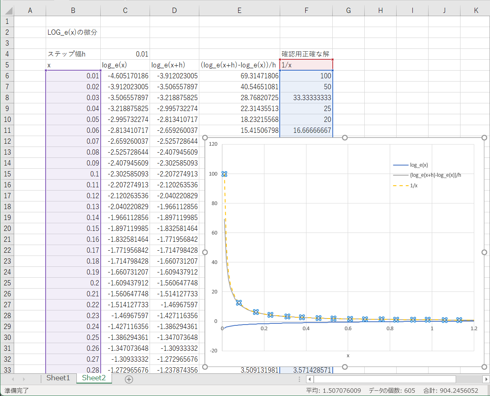

# コンピュータ物理学演習１

- 2024年度

```
2025/01/31
東海大学理系教育センター
滝内賢一
```
---

## 第３回

### Excel で行なう，数値微分，数値積分


### （１）Excelで微分をおこなう

微分には極限操作がおこなわれているが計算機は有限の値しか扱えないので微少な量の差分をとる。

微分

$$
\frac{d f(x)}{d x}=\lim_{h\rightarrow 0}\frac{f(x+h)-f(x)}{h}
$$

の定義から，差分の定義を考えると何通りかできる。

前進差分商

$$
\frac{\Delta f(x)}{\Delta x}=\frac{f(x+h)-f(x)}{h} 
$$

後進差分商

$$
\frac{\Delta f(x)}{\Delta x}=\frac{f(x)-f(x-h)}{h} 
$$

中心差分商

$$
\frac{\Delta f(x)}{\Delta x}=\frac{f(x+h/2)-f(x-h/2)}{h} 
$$
 
<!--- 
   
--->


### 「微分」三角関数 $\sin(x)$ の微分が $\cos(x)$になっていることを数値的に確かめる．

[1.表計算 動画](./media/2024-08-21_1.mp4)

[2.グラフ作成 動画](./media/2024-08-21_2.mp4)

[表計算ポイント1](./media/2024-08-21_2.png)

[表計算ポイント2](./media/2024-08-21_3.png)

[表計算ポイント3](./media/2024-08-21_4.png)

[表計算ポイント4](./media/2024-08-21_5.png)


### 「微分」 $\log_e(x)$ の微分が $\frac{1}{x}$ になっていることを確かめる．(x=0.01から1.2までの範囲)

自然対数LOGの関数は =LN（値） と入力します。
    



### （２）Excelで積分をおこなう

計算機による差分を使った数値積分をおこなう。

$$
\begin{align}
\int_a^b f(x)dx &=\lim_{n\to \infty}\sum_{i=0}^{n-1}f(x_i)\Delta x\\
\Delta x &=\frac{b-a}{n} ,\;\; x_i=a + i \Delta x
\end{align}
$$


    
関数 $y=f(x)$ の数値積分

$x_{i+1}-x_i=\Delta x$ として

方形公式

長方形の面積を初期値 $a$ から足してゆく場合

$$
\int_a^b f(x)dx \sim \sum_{i=0}^{n-1}f(x_i)\Delta x
$$

台形公式

台形の面積を初期値 $a$ から足してゆく場合

$$
\int_a^b f(x)dx \sim \sum_{i=0}^{n-1}\frac{1}{2}\left(f(x_i)+f(x_i+\Delta x)\right)\Delta x
$$

*注意*

定積分を有限の和で行なうとき，和の最後の項$i=n-1$までの和であることに注意。

### 「積分」 $\sin(x)$ の定積分

$$
\int_{0}^{\frac{\pi}{2}} \sin(x) dx
$$

($x=0$から$x=\pi/2$ )を調べてみる

   方形積分，台形積分を比較する。

$$
\begin{align}
\Delta S0=f(x_i) \Delta x ,\;\; \mathrm{SUM0}=\sum_{i=0}^{n-1} \Delta S0 \\
\Delta S1=\frac{1}{2}(f(x_i)+f(x_i+\Delta x)) \Delta x ,\;\; \mathrm{SUM1}=\sum_{i=0}^{n-1} \Delta S1
\end{align}
$$

とりあえず，$\Delta x=0.1$ として0から1.6まで計算してみる。


$\Delta x$ を変えて，積分範囲を修正しよう。

n=32, a=0, $b=\pi/2$ として，セルA2 を変更

$$
\Delta x=\frac{b-a}{n}=\frac{\pi}{2\times 32} = 0.049087
$$


    
### 「積分」 $e^x$ の定積分

$$
\int_{0}^{1} e^{x} dx
$$

($x=0$から$x=1$ )を調べてみる

方形積分と台形積分とで求めた定積分の値を比較してみよう。


### 「積分」 $4/(1+x^2)$ の定積分

$$
\int_{0}^{1} \frac{4}{1+x^2} dx
$$

($x=0$から$x=1$ )を調べてみる。

じつはこの積分の値は，逆正接関数の性質から円周率 $\pi$ であることが知られている（詳しくは第３回の補足資料を参照）。

方形積分，台形積分，シンプソンの公式を比較
   
シンプソンの公式を入れて表を完成させてみよう

$$
\begin{align}
\Delta S2=\frac{1}{6}\left\{ f(x_i)+4 f(x_i+\Delta x/2)+f(x_i+\Delta x)\right\} \Delta x ,\;\; \mathrm{SUM2}=\sum_{i=0}^{n-1} \Delta S2
\end{align}
$$


### エクセルの数式入力について

マイナス (-) について気をつけること！

`-A6^2`　は　`(-A6)^2` と同じで，マイナスも含めて２乗されるので注意して下さい。
    
`-1*A6^2` のマイナス１は２乗されない。


### SUM 関数について

積分の計算で和を求める必要があるとき，SUM()関数をつかっても計算可能です。

例

SUM(A1:A10)

`A1`から`A10`までの和の結果

