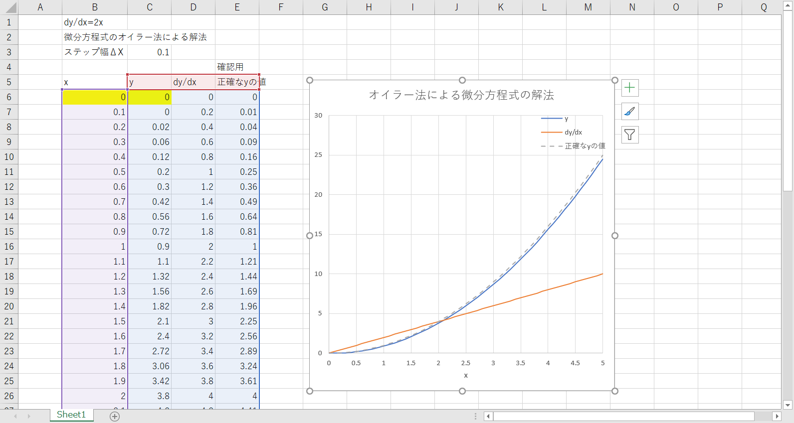
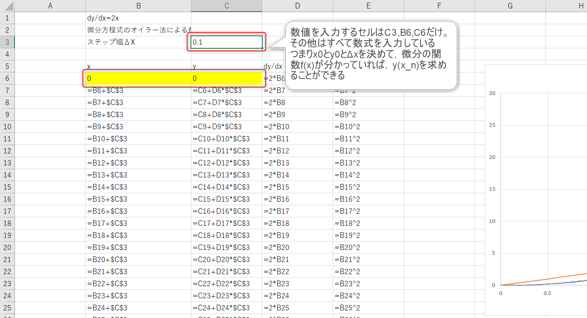
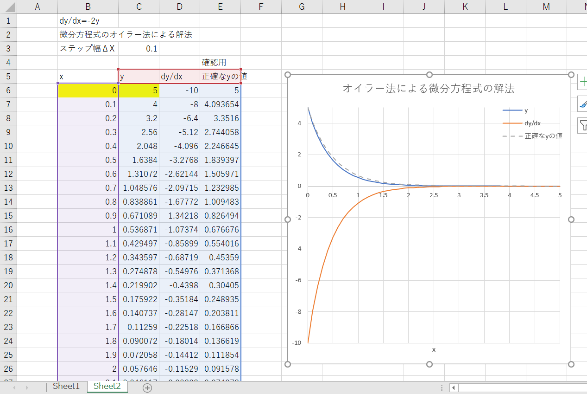
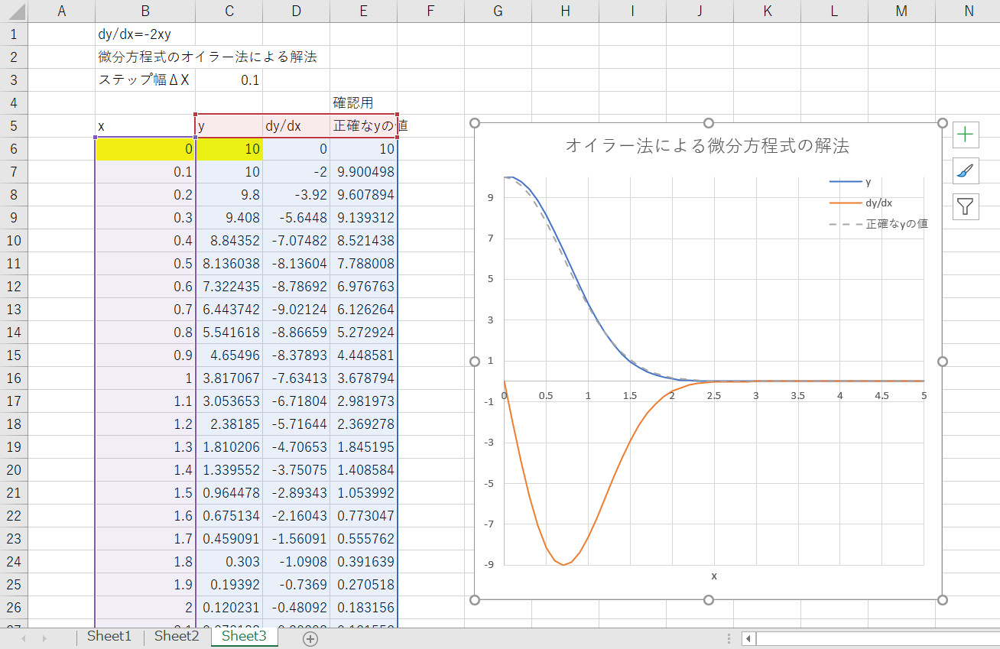
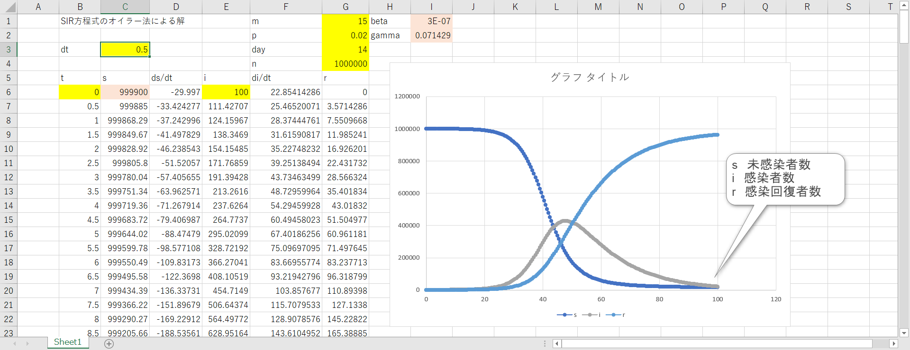
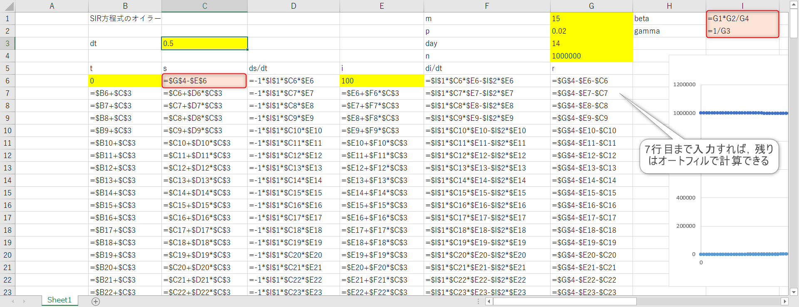

# コンピュータ物理学演習１

- 2024年度

2025/01/31

東海大学理系教育センター

滝内賢一
---


## 第４回

## Excelで微分方程式を数値的に解く

微分方程式

$$
\frac{dy}{dx}=f(x)
$$

を数値的に解く。すなわち $f(x)$ が分っているとき，$y(x)$ について求める。

### オイラー法

オイラー法は微分方程式を解く解法の一つである。

微分を差分として近似する。

$$
f(x)=\frac{y(x+\Delta x)-y(x)}{\Delta x}=\frac{\Delta y}{\Delta x} \\
y(x+\Delta x)-y(x) = \frac{\Delta y}{\Delta x} \Delta x = f(x) \Delta x \\
y(x+\Delta x) = y(x) + \frac{\Delta y}{\Delta x} \Delta x = y(x) + f(x) \Delta x
$$

$x=x_0$ と$y(x_0)$が与えられれば，上式より
$y(x_0+\Delta x) = y(x_0) + f(x_0) \Delta x $ が得られ，$y(x_0+\Delta x)$ の値が計算できる。

$y(x_0+\Delta x)$が与えられれば，
$y((x_0+\Delta x)+\Delta x) = y(x_0+\Delta x) + f(x_0+\Delta x) \Delta x $ が得られ，$y(x_0+2\Delta x)$ の値が計算できる。

これを繰り返せば

$x_n=x_0+n\Delta x$ の値の関数値$y(x_0+n\Delta x)$ も計算できる。

これがオイラー法による微分方程式の数値的解法である。

一般に$y(x_{n+1})=y(x_n)+f(x_n)\Delta x$ $\{x_0,x_1,x_2,x_3,\dots\}$と書き，漸化式と呼ぶ。

<!---

--->

#### 具体例１

次の微分方程式

$$
\frac{dy}{dx} = 2 x
$$

を数値的に解いてみる。初期条件は $x=0$ で $y=0$ である．範囲は $x=0.0$ から $5.0$まで。

（解析的な答えは $y=x^2$ である）

[（動画）](./media/2024-08-23_1.mp4)

グラフの書き方

[（動画）](./media/2024-08-23_2.mp4)





#### 具体例２

同様に微分方程式

$$
\frac{dy}{dx}=-2y
$$

の微分方程式を数値的に解いてみよう。（画） 初期条件は $x=0$ で $y=5$。範囲は $x=0.0$ から $5.0$まで。

（解析的な答えは $y=5e^{-2x}$ である）



#### 具体例３

つぎの微分方程式

$$ \frac{dy}{dx} = -2xy $$ 

を数値的に解いてみよう。（画） 初期条件は $x=0$ で $y=10$ 。範囲は $x=0.0$ から $5.0$ まで。

変数分離型の微分方程式だから手で計算して解いてみよう（授業資料ＰＤＦの１６ページを参照）。

```
（ヒント：答えは y=A*e^{Bx^2} の形になる）
```




### 参考 連立微分方程式 SIR方程式

感染症の感染者数がどのように時間変化するかを表わす方程式の一つ。

連立微分方程式になっているが，オイラー法でも解ける。

未感染者数を $S=S(t)$，感染者数を $I=I(t)$，回復者数または死亡者数を $R=R(t)$ と表わす。

感受性保持者（Susceptible），感染者（Infected），免疫保持者（Recovered）の頭文字を表している。

仮定として全人口は一定数 $N$ で変化しないとする。

$$
N = S + I + R
$$

時間微分して

$$
0 = \frac{dS}{dt} + \frac{dI}{dt} + \frac{dR}{dt} \\
 \frac{dI}{dt}  = - \frac{dS}{dt} - \frac{dR}{dt} 
$$

感染者数の変化は，感染者数，未感染者数に比例し，回復者数の分だけ減少すると考える。

$$
\frac{dI}{dt} = +\beta S I - \gamma  I \\
\frac{dS}{dt} = -\beta S I \\
\frac{dR}{dt} = \gamma  I \\
$$

$R$ は$N=S+I+R$ から求められるので、3つの方程式は、実際には２つの連立微分方程式を求めればよいことがわかる。

つまり

$$
\frac{dI}{dt} = +\beta S I - \gamma  I \\
\frac{dS}{dt} = -\beta S I \\
R =N-S-I \\
$$


パラメータの設定について
```

dt = 0.5 | 時間単位 1 は1日を表している

N = 10^6 | 全人口数 100万人とする

m = 15    | 一日当たり一人が接触する人数。 閉じこもることで、減少可能なパラメータ。

p = 0.02  | 接触の際に感染する確率。 マスクをすることで、減少可能なパラメータ。

day = 14  | 感染している日数、または回復するまでにかかる日数 

beta = m*p/N

gamma = 1/day
```

```
初期条件 t=0 のときの値

i = 100 # 0日に感染者数100名から始める

s = N - i

r = 0

t=0 から t=100 （100日）まで計算してみる。

```

オイラー法で計算してみる

$$
S_{n+1} = S_n + (-\beta * S_n * I_n)*\Delta t \\
I_{n+1} = I_n + (+\beta * S_n * I_n-\gamma * I_n)*\Delta t \\
R_{n+1} = N - S_{n+1} - I_{n+1}  
$$





参考URL

https://club.informatix.co.jp/?p=140

https://ja.wikipedia.org/wiki/SIR%E3%83%A2%E3%83%87%E3%83%AB


