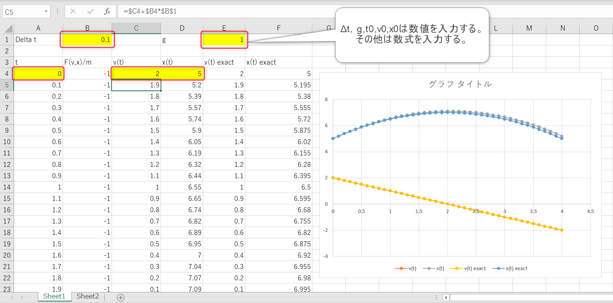
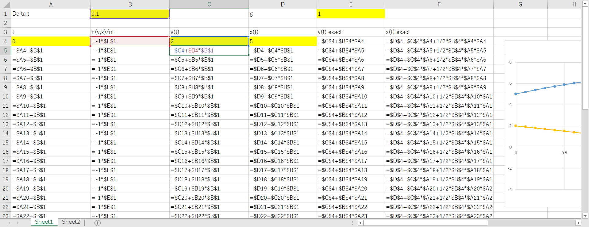
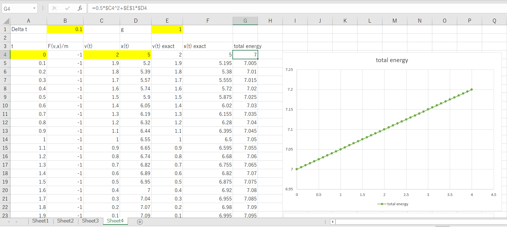
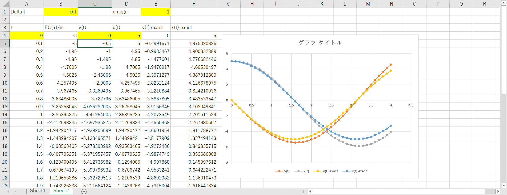
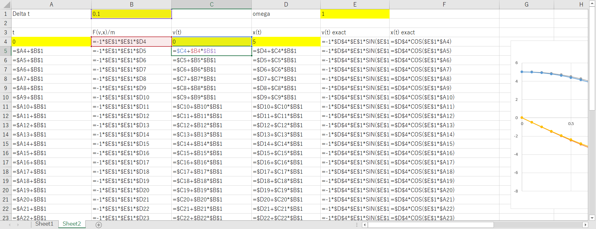
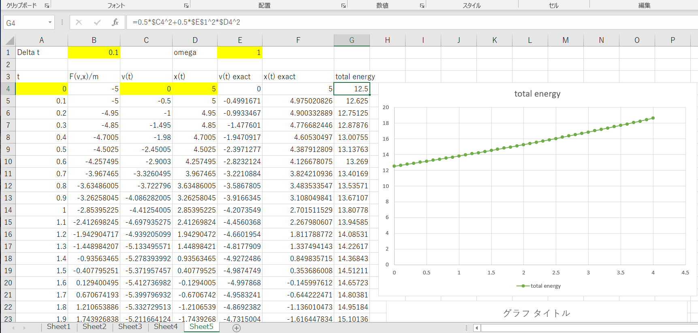
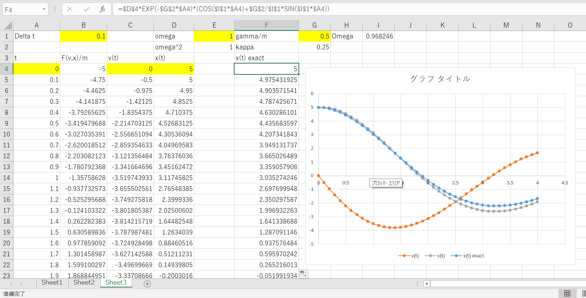
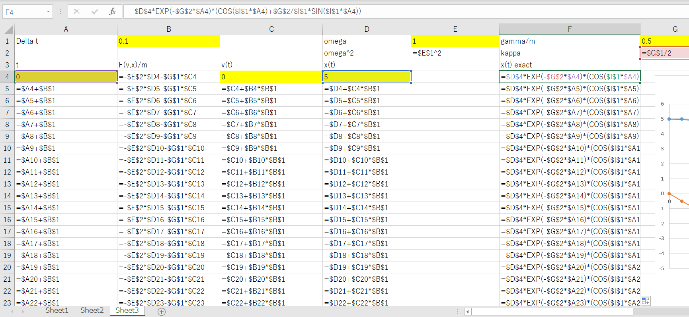

# コンピュータ物理学演習１
- 2025年度

内容は適宜更新．（2025/01/28）

## 第5回

## おさらい。Excelで微分方程式を数値的に解く

微分方程式

$$
\frac{dy}{dx}=f(x)
$$

を数値的に解く。すなわち右辺の関数 $f(x)$ が分っているとき，左辺の微分された関数$y(x)$ の具体的な形について求めたい。

### オイラー法

オイラー法は微分方程式を解く解法の一つである。

微分を差分として近似する。

$$
\begin{align}
f(x)&=\frac{y(x+\Delta x)-y(x)}{\Delta x}=\frac{\Delta y}{\Delta x} \\
y(x+\Delta x)-y(x) &= \frac{\Delta y}{\Delta x} \Delta x = f(x) \Delta x \\
y(x+\Delta x) &= y(x) + \frac{\Delta y}{\Delta x} \Delta x = y(x) + f(x) \Delta x
\end{align}
$$

$x=x_0$ と$y(x_0)$が得られれば，上式より
$y(x_0+\Delta x) = y(x_0) + f(x_0) \Delta x $ が得られ，$y(x_0+\Delta x)$ の値が計算できる。

$y(x_0+\Delta x)$が与えられれば，$x = x_0+\Delta x$と共に上式に代入することによって
$y((x_0+\Delta x)+\Delta x) = y(x_0+\Delta x) + f(x_0+\Delta x) \Delta x $ が得られ，$y(x_0+2\Delta x)$ の値が計算できる。

これを繰り返せば

$x_n=x_0+n\Delta x$ の値の関数値$y(x_0+n\Delta x)$ も計算できる。

これがオイラー法による微分方程式の数値的解法である。

一般に
$$
\begin{align}
y(x_{n+1})=y(x_n)+f(x_n)\Delta x\\
x_n = x_0,x_1,x_2,x_3,\dots
\end{align}
$$と書き，漸化式と呼ぶ。

<!---

--->

## 運動方程式を解く

### 二階の微分方程式

微分方程式の数値解法（オイラー法）を使って，ニュートンの運動方程式（２階の微分方程式）を１階の連立微分方程式と考えて解く。

$$
m\frac{d^2x}{dt^2}=F(x,v,t)
$$

この二階微分の方程式を

$$
\begin{align}
\frac{dv}{dt}&=\frac{1}{m}F(x,v,t) \\
\frac{dx}{dt}&=v
\end{align}
$$
一階の微分方程式の連立方程式と考える。

求めたい関数は$x(t),v(t)$で，分かっているのは$F(x,v,t)$の形と$m$の値と初期条件，$t=0$での$v=v_0,x=x_0$である。

オイラー法での解法

$x_{n+1}=x_n+\Delta x$ のとき，関数$y(x)$,$z(x)$の連立微分方程式

$$
\begin{align}
\frac{dy}{dx}&=f(x,y,z) , \qquad y_{n+1}=y_n+f(x_n,y_n,z_n)\Delta x \\
\frac{dz}{dx}&=g(x,y,z) , \qquad z_{n+1}=z_n+g(x_n,y_n,z_n)\Delta x 
\end{align}
$$

を記号などを書き換えて($x\to t,y\to v,z\to x$)

$$
\begin{align}
\frac{dv}{dt}&=f(t,v,x)=\frac{1}{m}F(v,x)\\
\frac{dx}{dt}&=g(t,v,x)=v
\end{align}
$$
として

$$
\begin{align}
v_{n+1}&=v_{n}+f(t_n,v_n,x_n) \Delta t = v_{n}+\frac{1}{m}F(v_n,x_n) \Delta t\\
x_{n+1}&=x_{n}+g(t_n,v_n,x_n) \Delta t = x_{n}+v_n \Delta t 
\end{align}
$$

を解けばよい。

#### 例 等加速度運動（自由落下）

運動方程式

$$
\begin{align}
m\frac{dv}{dt}&=-mg\\
\frac{dx}{dt}&=v
\end{align}
$$

$t=0$で$x=5$，$v=2$とする。$g=1.0$

$$
\begin{align}
\frac{dv}{dt}&=-g\\
\frac{dx}{dt}&=v
\end{align}
$$

$$
\begin{align}
\frac{v_{n+1}-v_{n}}{\Delta t}&=-g\\
\frac{x_{n+1}-x_{n}}{\Delta t}&=v_n
\end{align}
$$

変形して

$$
\begin{align}
v_{n+1}&=v_{n}-g\Delta t\\
x_{n+1}&=x_{n}+v_n\Delta t
\end{align}
$$

オイラー法では時間の変化$\Delta t$の一乗だけ考えている。等加速度運動は$x(t)=x_0+v_0 t-\frac{1}{2}gt^2$ より
$t$の二乗で変化しているので誤差が生じる。解決するためには，オイラー法ではない他の方法を考える必要がある。

E列とF列はオイラー法で求めた解が正確な解と一致するかどうかを確認するために作成した。C列D列の計算を行なうために間違えてE列とF列を
使わないようにすること。

単位質量あたりの力学的エネルギーを計算してみる。力学的エネルギーは保存する（時間経過しても一定値のまま変化しない）はずだが，増加している。つまり力学的エネルギーが保存していない。
これはオイラー法が原因である。力学的エネルギーを保存するためにはオイラー法以外の方法が必要である（興味がある方はシンプレクティック法を調べるとよい）。

#### 例 単振動（調和振動）

運動方程式

$$
\begin{align}
\frac{dv}{dt}&=-\omega^2 x\\
\frac{dx}{dt}&=v
\end{align}
$$

$t=0$で$x=5$，$v=0$とする。$\omega=1.0$

等加速度運動を入力したシートと比較すると，$t$と$v,x$ の列は数式はそのままである。

再び，単位質量あたりの力学的エネルギーを計算してみる。力学的エネルギーは保存する（時間経過しても一定値のまま変化しない）はずだが。。。

#### 例 減衰振動

運動方程式

$$
\begin{align}
m\frac{dv}{dt}&=-kx-\gamma v\\
\frac{dx}{dt}&=v
\end{align}
$$

$t=0$で$x=5$，$v=0$とする。$\omega=1.0,\gamma/m=0.5$

