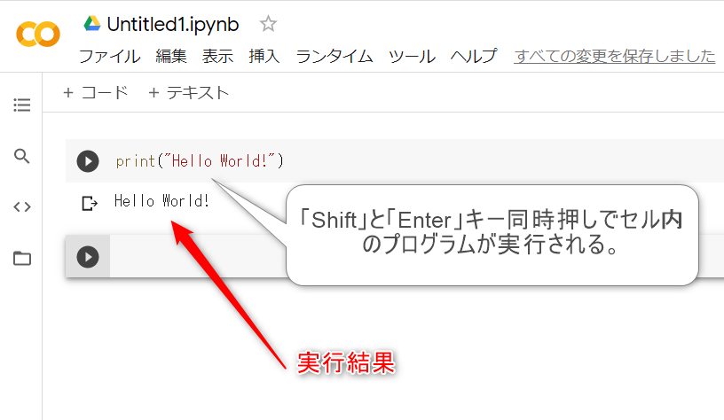
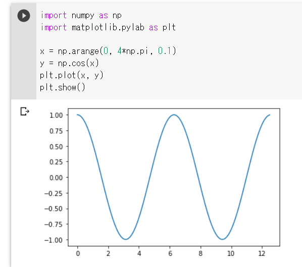
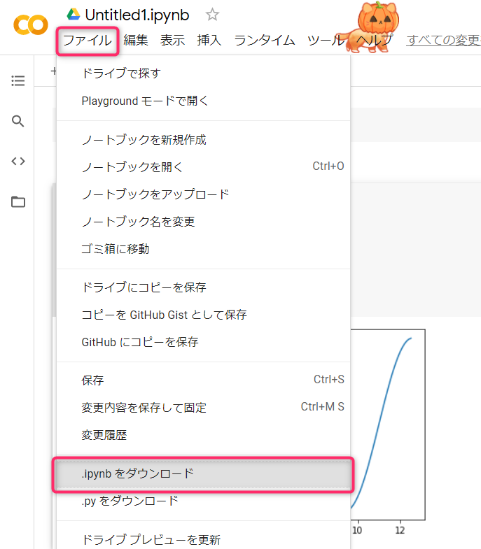
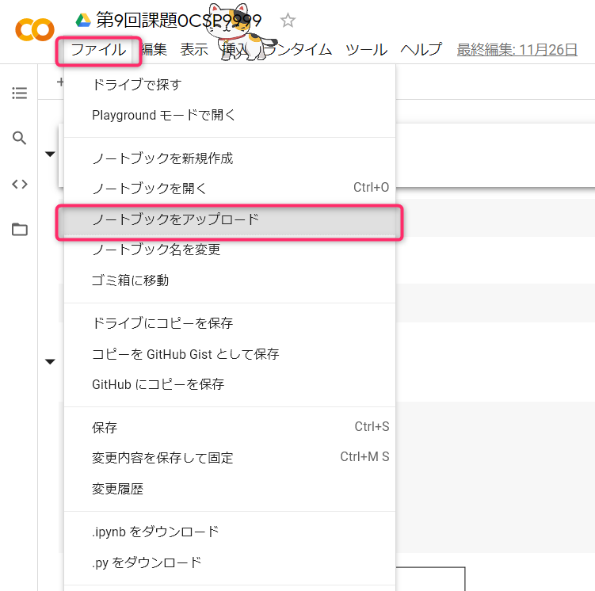

## 第６回 Google Colaboratory で python を始める
2025/10/29

### Google Colaboratory とは
Colaboratory（Colab）は、Web ブラウザから Python を記述・実行できるWebサービス（SaaS）です。  
Python とはコンピュータプログラミング言語の１つで，情報科学や機械学習の分野でよく使われる言語です。  
通常、Python は自分のPCにインストールして計算や実行を行いますが、Google Colaboratory を利用すると自分のPCにインストールする必要がなく、計算の実行も Google のサーバで行ないます。  
Python 学習の初歩として非常に手軽で敷居が低いシステムです。

- Colaboratory へようこそ（参考）  
  [https://colab.research.google.com/notebooks/welcome.ipynb?hl=ja](https://colab.research.google.com/notebooks/welcome.ipynb?hl=ja)

---

### 始めてみる
[始めてみる動画](./media/2020-10-30_start_gc.mp4)

Web ブラウザを利用します。FireFox，Edge，Safariでも利用できますが，Chromeをおすすめします。  
Chrome を起動して下さい。  
Google アカウントにログインして，Google ドライブにアクセスして下さい。  
マイドライブから「その他 ＞ Google Colaboratory」を選んで下さい。  
Google Colaboratory のサイトに移動します。

---

**注意**  
Google Colaboratory が見つからない場合は、  
[https://colab.research.google.com/notebooks/welcome.ipynb?hl=ja](https://colab.research.google.com/notebooks/welcome.ipynb?hl=ja)  
にアクセスして、左上の「ファイル ＞ ドライブの新しいノートブック」をクリックしてください。

---

Untitled0.ipynb ファイルが作成されますので、「セル」にpythonでプログラムを書き込みます。  
一番初めに文字を表示してみましょう。

```python
print("Hello World!")
```

書き終えたら「Shift」＋「Enter」キー同時押しでセル内のプログラムが実行します。  
この場合、実行後にカーソルが次のセルに移動します。

- セルの左にある（▶）の再生アイコンをクリックしても実行可能。  
- Cmd/Ctrl + Enter でも実行可能（カーソルはそのまま）。  
- Alt + Enter を押すと新しいコードセルを挿入。

実行結果やエラーメッセージがその下に表示されます。



このように Google Colaboratory はセル単位で入力・実行・結果表示を繰り返します。  
次のセルに以下のプログラムを書き込んでみましょう。これはグラフを表示するプログラム（ソースコード）です。

```python
import numpy as np
import matplotlib.pylab as plt

x = np.arange(0, 4*np.pi, 0.1)
y = np.cos(x)
plt.plot(x, y)
plt.show()
```



---

### ファイルを保存して，ipynbファイルを課題提出する
[保存とダウンロード動画](./media/2020-10-30_file_save_ipynb.mp4)

ファイル名を変更して Google ドライブに保存しましょう。  
次に、OpenLMS の課題提出を ipynb 形式のファイルで提出します。  
そのために自分の PC に ipynb ファイルを保存し、OpenLMS にログインして提出します。



---

### パソコンにダウンロードした ipynb ファイルを再び開く方法
Google Colaboratory の左上メニュー「ファイル」＞「ノートブックをアップロード」を押して、開きたいファイルを選択します。



---

### おまけ
猫モード（画面上を猫が歩くだけ）を設定する場合は、  
右上の歯車 ＞ その他 ＞ 猫モード　をチェックして保存します。

---

### 参考URL
- よくある質問  
  [https://research.google.com/colaboratory/faq.html](https://research.google.com/colaboratory/faq.html)

- Overview of Colaboratory Features  
  [https://colab.research.google.com/notebooks/basic_features_overview.ipynb#scrollTo=JyG45Qk3qQLS](https://colab.research.google.com/notebooks/basic_features_overview.ipynb#scrollTo=JyG45Qk3qQLS)

- Markdown Guide  
  [https://colab.research.google.com/notebooks/markdown_guide.ipynb](https://colab.research.google.com/notebooks/markdown_guide.ipynb)
